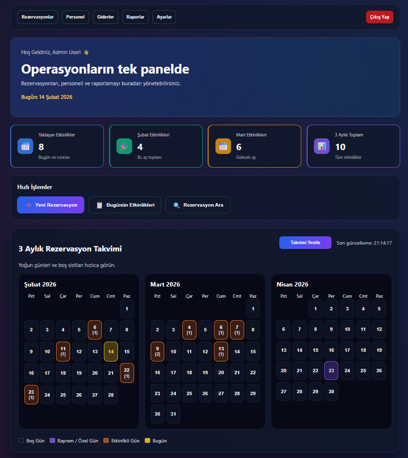
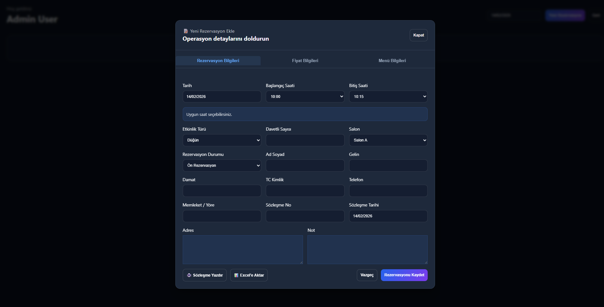
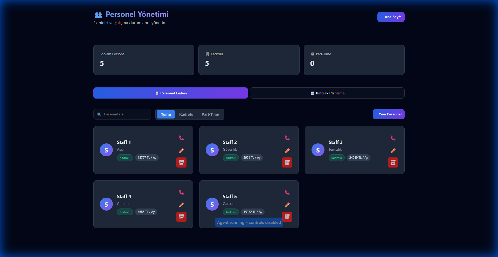
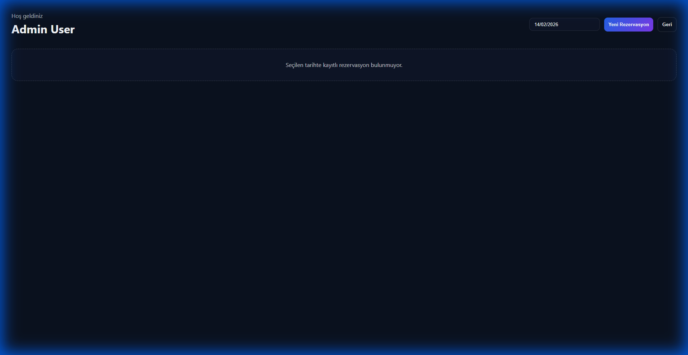

<div align="center">
  

  # 💍 DugunSalonuApp

  **Modern Düğün Salonu Yönetim Sistemi**

  Rezervasyonlardan personel takibine, mali raporlardan ayarlara kadar
  düğün salonu operasyonlarınızı tek panelden yönetin.

  [](https://dogukantoprak.github.io/DugunSalonuAppDemo/)
  [](https://react.dev/)
  [](https://fastapi.tiangolo.com/)
  [](https://www.electronjs.org/)
  [](https://www.typescriptlang.org/)

</div>

---

## 📋 İçindekiler

- [Proje Hakkında](#-proje-hakkında)
- [Canlı Demo](#-canlı-demo)
- [Özellikler](#-özellikler)
- [Ekran Görüntüleri](#-ekran-görüntüleri)
- [Teknoloji Stack](#-teknoloji-stack)
- [Mimari Yapı](#-mimari-yapı)
- [Kurulum](#-kurulum)
- [Kullanım](#-kullanım)
- [Proje Yapısı](#-proje-yapısı)
- [API Dokümantasyonu](#-api-dokümantasyonu)
- [Lisans](#-lisans)

---

## 🎯 Proje Hakkında

**DugunSalonuApp**, düğün ve etkinlik salonlarının günlük operasyonlarını dijitalleştirmek için geliştirilmiş **tam kapsamlı (full-stack)** bir yönetim sistemidir. Uygulama hem **web tarayıcı** üzerinden hem de **Electron** ile masaüstü uygulama olarak çalışabilir.

### Neden Bu Projeyi Geliştirdim?

Düğün salonu işletmeleri genellikle kağıt üzerinde veya dağınık Excel tablolarıyla yönetilmektedir. Bu proje ile:
- ✅ Çakışmasız, takvim tabanlı **akıllı rezervasyon** sistemi
- ✅ Personel listesi, maaş takibi ve **haftalık planlama**
- ✅ Gelir-gider analizi ile **mali raporlama**
- ✅ Rol bazlı yetkilendirme ile **veri güvenliği**

tek bir modern arayüzde sunulmuştur.

---

## 🌐 Canlı Demo

> **[🔗 https://dogukantoprak.github.io/DugunSalonuAppDemo/](https://dogukantoprak.github.io/DugunSalonuAppDemo/)**

Proje tanıtım sayfasında uygulamanın özelliklerini, ekran görüntülerini ve teknoloji altyapısını inceleyebilirsiniz.

---

## ✨ Özellikler

| Modül | Açıklama |
|-------|----------|
| 📊 **Dashboard** | Yaklaşan etkinlikler, aylık istatistikler, 3 aylık takvim görünümü, hızlı işlem butonları |
| 📅 **Rezervasyonlar** | Tarih/saat bazlı rezervasyon oluşturma, çakışma kontrolü, salon seçimi, durum takibi |
| 👥 **Personel Yönetimi** | Kadrolu/part-time personel kayıtları, rol atamaları, maaş bilgileri, haftalık planlama |
| 💰 **Giderler** | Kategori bazlı harcama kaydı, rezervasyonla ilişkilendirme |
| 📈 **Raporlar** | Dönemsel gelir-gider analizi, grafik ve tablo formatında detaylı raporlama |
| ⚙️ **Ayarlar** | Salon tanımları, menü yönetimi, etkinlik türleri, uygulama konfigürasyonu |
| 🔐 **Kimlik Doğrulama** | Kullanıcı kayıt/giriş, rol bazlı erişim kontrolü (Admin, Staff, Viewer) |

### Öne Çıkan Teknik Detaylar

- 🗓️ **3 Aylık Takvim Görünümü** — Yoğun/boş günleri renk kodlarıyla anında görün
- 📄 **PDF & Excel Dışa Aktarım** — Sözleşme yazdırma ve rezervasyon verilerini Excel'e aktarma
- 🖥️ **Masaüstü Uygulama** — Electron entegrasyonu ile Windows için native .exe build
- 🌙 **Dark Mode Arayüz** — Göz yormayan, modern koyu tema tasarımı
- ⚡ **Gerçek Zamanlı API** — FastAPI ile yüksek performanslı RESTful backend

---

## 📸 Ekran Görüntüleri

<div align="center">

### Dashboard — Ana Panel


*3 aylık takvim, istatistik kartları ve hızlı işlem butonları*

---

### Yeni Rezervasyon — Detaylı Form


*Çok sekmeli form: Rezervasyon bilgileri, fiyat bilgileri ve menü bilgileri*

---

### Personel Yönetimi


*Kadrolu/part-time filtreleme, maaş bilgileri, arama ve personel kartları*

---

### Rezervasyon Listesi


*Tarih bazlı rezervasyon görüntüleme ve yeni rezervasyon oluşturma*

</div>

---

## 🛠️ Teknoloji Stack

### Frontend
| Teknoloji | Versiyon | Kullanım Amacı |
|-----------|----------|----------------|
| **React** | 19 | UI bileşen framework'ü |
| **TypeScript** | 5.9 | Tip güvenli geliştirme |
| **Vite** | 7.2 | Hızlı build ve geliştirme sunucusu |
| **React Router** | 7.9 | Sayfa yönlendirme |
| **Electron** | 31 | Masaüstü uygulama (Windows) |
| **jsPDF** | 4.0 | PDF sözleşme yazdırma |
| **xlsx** | 0.18 | Excel dışa aktarım |

### Backend
| Teknoloji | Versiyon | Kullanım Amacı |
|-----------|----------|----------------|
| **Python** | 3.x | Backend dili |
| **FastAPI** | 0.112 | REST API framework'ü |
| **Pydantic** | 2.8 | Veri validasyonu |
| **Uvicorn** | 0.30 | ASGI sunucusu |
| **SQLite** | — | Gömülü veritabanı |

---

## 🏗️ Mimari Yapı

```
┌─────────────────────────────────────────────────────────────┐
│                    ELECTRON SHELL (Windows)                   │
│  ┌───────────────────────────────────────────────────────┐  │
│  │              REACT FRONTEND (Vite + TS)               │  │
│  │                                                       │  │
│  │   ┌──────────┐ ┌──────────┐ ┌──────────┐ ┌────────┐ │  │
│  │   │Dashboard │ │Rezervasyon│ │ Personel │ │Raporlar│ │  │
│  │   └──────────┘ └──────────┘ └──────────┘ └────────┘ │  │
│  │   ┌──────────┐ ┌──────────┐ ┌──────────┐            │  │
│  │   │ Giderler │ │ Ayarlar  │ │  Auth    │            │  │
│  │   └──────────┘ └──────────┘ └──────────┘            │  │
│  └───────────────────┬───────────────────────────────────┘  │
│                      │ HTTP (REST API)                       │
│  ┌───────────────────▼───────────────────────────────────┐  │
│  │             FASTAPI BACKEND (Python)                   │  │
│  │                                                       │  │
│  │   ┌──────────────┐  ┌──────────────┐  ┌────────────┐ │  │
│  │   │  Controllers │  │    Models    │  │  Database  │ │  │
│  │   │              │  │              │  │  (SQLite)  │ │  │
│  │   │ • Reservation│  │ • Reservation│  │            │ │  │
│  │   │ • Personnel  │  │ • User       │  │  salon.db  │ │  │
│  │   │ • Reports    │  │              │  │            │ │  │
│  │   │ • Settings   │  │              │  │            │ │  │
│  │   │ • Attendance │  │              │  │            │ │  │
│  │   │ • User       │  │              │  │            │ │  │
│  │   └──────────────┘  └──────────────┘  └────────────┘ │  │
│  └───────────────────────────────────────────────────────┘  │
└─────────────────────────────────────────────────────────────┘
```

---

## 🚀 Kurulum

### Gereksinimler

- **Node.js** ≥ 18
- **Python** ≥ 3.9
- **npm** veya **yarn**

### 1. Projeyi Klonlayın

```bash
git clone https://github.com/dogukantoprak/DugunSalonuAppDemo.git
cd DugunSalonuApp
```

### 2. Backend Kurulumu

```bash
# Python bağımlılıkları
pip install -r requirements.txt

# Veritabanı tablolarını oluştur (otomatik olarak başlangıçta da oluşur)
python -c "from backend.database.db_manager import create_tables; create_tables()"

# Backend sunucusunu başlat
python main.py
```

Backend `http://localhost:8000` adresinde çalışacaktır.

### 3. Frontend Kurulumu

```bash
cd frontend

# Bağımlılıkları yükle
npm install

# Geliştirme sunucusunu başlat
npm run dev
```

Frontend `http://localhost:5173` adresinde çalışacaktır.

### 4. Masaüstü Uygulama (Opsiyonel)

```bash
# Geliştirme modunda masaüstü uygulama
npm run dev:desktop

# Windows .exe oluştur
npm run build:desktop
```

---

## 💻 Kullanım

1. Backend ve frontend'i başlattıktan sonra `http://localhost:5173` adresine gidin
2. **Kayıt Ol** sayfasından yeni bir hesap oluşturun
3. **Giriş Yap** ile sisteme bağlanın
4. Dashboard'dan tüm modüllere erişin:
   - 📅 **Rezervasyonlar** → Yeni etkinlik oluşturun, takvimden kontrol edin
   - 👥 **Personel** → Çalışan ekleyin, haftalık plan oluşturun
   - 💰 **Giderler** → Harcamaları kategorize edin
   - 📈 **Raporlar** → Dönemsel analizleri görüntüleyin
   - ⚙️ **Ayarlar** → Salon, menü ve etkinlik türlerini yönetin

---

## 📁 Proje Yapısı

```
DugunSalonuApp/
├── backend/
│   ├── api/
│   │   └── server.py              # FastAPI uygulama ve endpoint tanımları
│   ├── controllers/
│   │   ├── reservation_controller.py   # Rezervasyon iş mantığı
│   │   ├── personnel_controller.py     # Personel CRUD işlemleri
│   │   ├── attendance_controller.py    # Yoklama ve vardiya yönetimi
│   │   ├── reports_controller.py       # Raporlama sorguları
│   │   ├── settings_controller.py      # Salon/menü/etkinlik ayarları
│   │   └── user_controller.py          # Kullanıcı kayıt ve giriş
│   ├── database/
│   │   └── db_manager.py          # SQLite bağlantı ve tablo yönetimi
│   └── models/
│       ├── reservation_model.py   # Rezervasyon veri modeli
│       └── user_model.py          # Kullanıcı veri modeli
├── frontend/
│   ├── electron/
│   │   └── main.js                # Electron ana pencere konfigürasyonu
│   ├── src/
│   │   ├── pages/
│   │   │   ├── DashboardPage.tsx       # Ana panel ve takvim
│   │   │   ├── ReservationsPage.tsx    # Rezervasyon yönetimi
│   │   │   ├── PersonnelPage.tsx       # Personel yönetimi
│   │   │   ├── ExpensesPage.tsx        # Gider takibi
│   │   │   ├── ReportsPage.tsx         # Raporlar
│   │   │   ├── SettingsPage.tsx        # Ayarlar
│   │   │   ├── LoginPage.tsx           # Giriş sayfası
│   │   │   └── RegisterPage.tsx        # Kayıt sayfası
│   │   ├── components/
│   │   │   ├── ReservationForm.tsx     # Çok sekmeli rezervasyon formu
│   │   │   ├── ReservationList.tsx     # Rezervasyon listesi
│   │   │   └── DateInput.tsx           # Tarih input bileşeni
│   │   ├── App.tsx                # Ana uygulama ve routing
│   │   └── App.css                # Global stiller
│   ├── package.json
│   └── vite.config.js
├── docs/                          # GitHub Pages tanıtım sayfası
├── main.py                        # Backend başlangıç noktası
└── requirements.txt               # Python bağımlılıkları
```

---

## 📡 API Dokümantasyonu

Backend çalışırken Swagger UI'a erişebilirsiniz:

> **[http://localhost:8000/docs](http://localhost:8000/docs)**

### Temel Endpoint'ler

| Method | Endpoint | Açıklama |
|--------|----------|----------|
| `POST` | `/api/login` | Kullanıcı girişi |
| `POST` | `/api/register` | Yeni kullanıcı kaydı |
| `GET` | `/api/reservations?date=YYYY-MM-DD` | Tarih bazlı rezervasyonlar |
| `POST` | `/api/reservations` | Yeni rezervasyon oluşturma |
| `GET` | `/api/calendar?year=YYYY&month=MM` | Takvim verileri |
| `GET` | `/api/reservations/unavailable?date=...&salon=...` | Dolu slotlar |
| `GET/POST` | `/api/settings/*` | Salon, menü, etkinlik ayarları |
| `GET/POST` | `/api/personnel/*` | Personel CRUD |
| `GET` | `/api/reports/*` | Raporlama verileri |
| `GET/POST` | `/api/attendance/*` | Yoklama ve vardiya |
| `GET` | `/api/health` | Sunucu sağlık kontrolü |

---

## 🗄️ Veritabanı Şeması

```sql
-- Ana tablolar
users             -- Kullanıcılar (Admin, Staff, Viewer rolleri)
reservations      -- Rezervasyonlar (detaylı etkinlik bilgileri)
staff             -- Personel kayıtları (kadrolu/part-time)
event_staff       -- Etkinlik-personel ilişkileri
expenses          -- Giderler ve harcamalar
settings_salons   -- Salon tanımları
settings_menus    -- Menü tanımları
settings_event_types  -- Etkinlik türleri
attendance        -- Yoklama kayıtları
schedule          -- Haftalık çalışma planları
```

---

## 📄 Lisans

Bu proje eğitim ve portfolyo amacıyla geliştirilmiştir.

---

<div align="center">

  **[🌐 Canlı Demo](https://dogukantoprak.github.io/DugunSalonuAppDemo/)** · **[⬆ Başa Dön](#-dugunsalonuappdemo)**

  *React 19 • TypeScript • FastAPI • Electron • SQLite ile geliştirildi*

</div>
